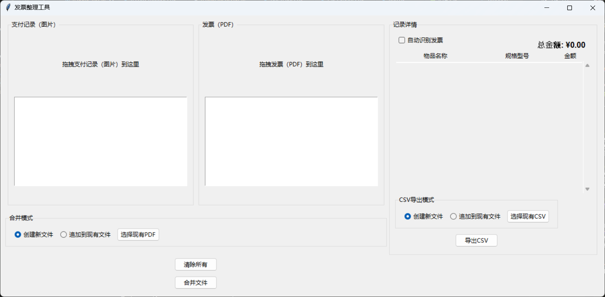
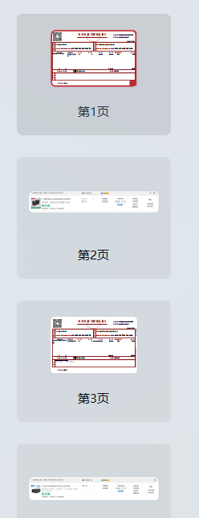
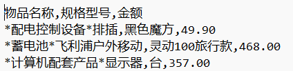

# 发票整理工具

一个基于Python开发的发票管理工具,可以帮助用户将支付记录和发票进行合并整理,并支持记录相关交易信息。

## 主要功能

### 文件处理
- 支持拖拽上传支付记录(图片格式)和发票(PDF格式)
- 支持创建新PDF或追加到现有PDF文件
- 自动识别发票信息(可选)

### 交易记录
- 记录物品名称、规格型号和交易金额
- 自动计算总金额
- 支持导出为CSV格式(新建或追加)

### 界面预览

### 合并后效果
输出得到的PDF:

输出得到的CSV:

## 使用说明
1. 拖入支付记录(图片)和发票(PDF)文件
2. 选择合并模式(新建/追加)
3. 填写或自动识别交易信息
4. 点击"合并文件"生成结果
5. 可选择导出交易记录到CSV

## 注意事项
- 自动识别交易信息仅支持文本型的PDF发票
