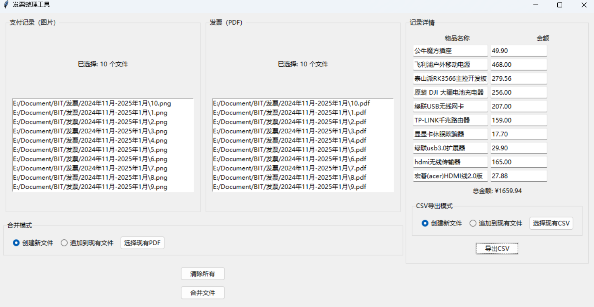

# 发票整理工具

这是一个用Python开发的发票整理工具，可以帮助用户将支付记录（图片格式）和发票（PDF格式）合并成一个PDF文件，并支持记录相关交易信息。

## 功能特点

- 支持拖拽上传支付记录（图片）和发票（PDF）
- 支持两种合并模式：
  - 创建新PDF文件
  - 追加到现有PDF文件
- 支持记录交易信息：
  - 物品名称
  - 交易金额
  - 自动计算总金额
- 支持导出交易记录：
  - 导出为CSV格式
  - 支持创建新文件或追加到现有文件

界面如下图所示：

